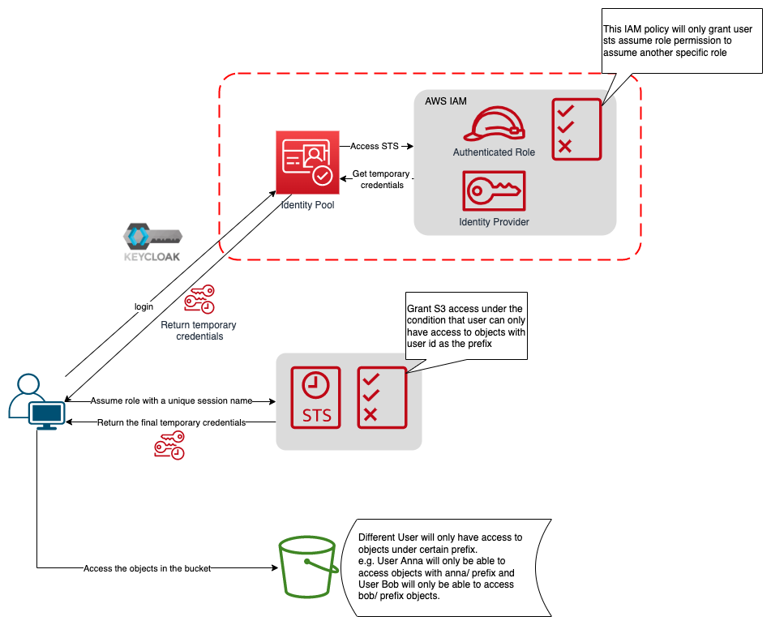

# builder-zoo

## Discover keycloak federation with AWS China account

When it comes to identity federation with AWS China accounts, the problem we quite often run into is the unavailability of cognito user pool. Without it, users would have to use their own identity management system to manage their own user pool. However, using third party pool comes with another issue, AWS resource authorization. Cognito user pool can be easily integrated with AWS IAM to control access permission via some clicks. The same can not hold true to third party user pool. Therefore, I decided to make some exploration on how to conduct fine-grain access control over AWS resource with third party user pool.

I would start my exploration with a simple scenario, a basic website that offers network drive functionality. This website will be backed by one AWS S3 bucket in Beijing region. The requirement is quite straightforward. Different users should only be able to manage objects under their own "folder" (or *prefix*, to be more precise). Users can then list, upload, download or delete those objects.

### Authorization process flow

With these requirements in mind, I came up with the following authorization process flow.



It might not be very intuitive in the graph above. I will explain the whole flow step by step.

Before I get into detail, readers are recommended to try out my testing network-drive-like website at [s3toolbox](https://s3toolbox.weitogo.org). This website does exactly what the scenario says. If the readers do try out that testing site, please use gmail or amazon.com mailbox as the email address for registration.

### Variables in IAM policy

Since almost almost the entire AWS platform utilizes IAM policy to define access, it is unavoidable to write IAM policy documents to define the every user's access permissions. But it is unrealistic to create a separate IAM policy for every single user, considering the potential large size of user pool for a website. Hence, I made some research and found one interesting feature of IAM policy, policy variable. If readers are interested, please refer to the [official documentation](https://docs.aws.amazon.com/IAM/latest/UserGuide/reference_policies_variables.html) for reference.

Here we are going to utilize a policy variable called **aws:userid** to define a condition for our s3 bucket access, so that different user would actually get only accesses to the objects with their unique prefix.

Here is a sample of such IAM policy:

```json
{
    "Version": "2012-10-17",
    "Statement": [
        {
            "Action": [
                "s3:ListBucket"
            ],
            "Effect": "Allow",
            "Resource": [
                "arn:aws-cn:s3:::<BUCKET NAME>"
            ],
            "Condition": {
                "StringLike": {
                    "s3:prefix": [
                        "${aws:userid}/*"
                    ]
                }
            }
        },
        {
            "Action": [
                "s3:*"
            ],
            "Effect": "Allow",
            "Resource": [
                "arn:aws-cn:s3:::<BUCKET NAME>/${aws:userid}/*"
            ]
        }
    ]
}
```

**aws:userid** actually can represent different values depending on what type of principal initiated the request. According to official document, **aws:userid** is equal to *role-id:caller-specified-role-name* (where role-id is the unique id of the role and the caller-specified-role-name is specified by the RoleSessionName parameter passed to the AssumeRoleWithWebIdentity request). But then there is one issue I discovered during my implementation. When I tried to pass RoleSessionName parameter in my request to Cognito Identity Pool, it simply ignored that parameter and nothing is being passed. That is the reason why I had to first use my federated identity to simply assume a specific role which is common for all users to get the first pair of temporary credentials and for that specific role, I granted only one permission for assuming another role so that I could correctly pass RoleSessionName in my request. That is also the ultimate reason why the process flow in the graph above shows two retrieval of temporary credentials.

### Authorization Process Flow

Once readers understand the logic of IAM policy variable, then we can finally come to the explanation of the whole process flow.

1. First user needs to login to the third party Idp such as keycloak to retrieve an access token.
2. Send assume role request to STS via cognito Identity pool to swap a pair of AWS credentials with access token.
3. Send another assume role request directly to STS to swap the second pair of AWS credentials with the previous pair.
4. Now the correct credential is retrieved. Users can make calls to S3 with the signed request by the credentials.
